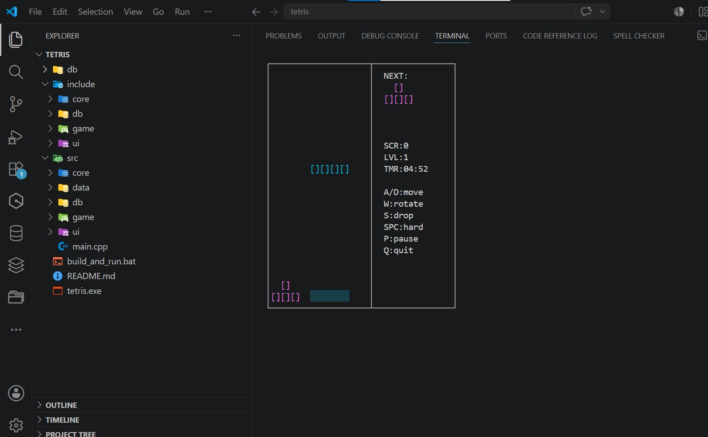
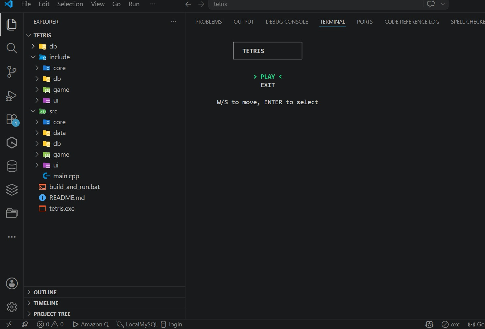
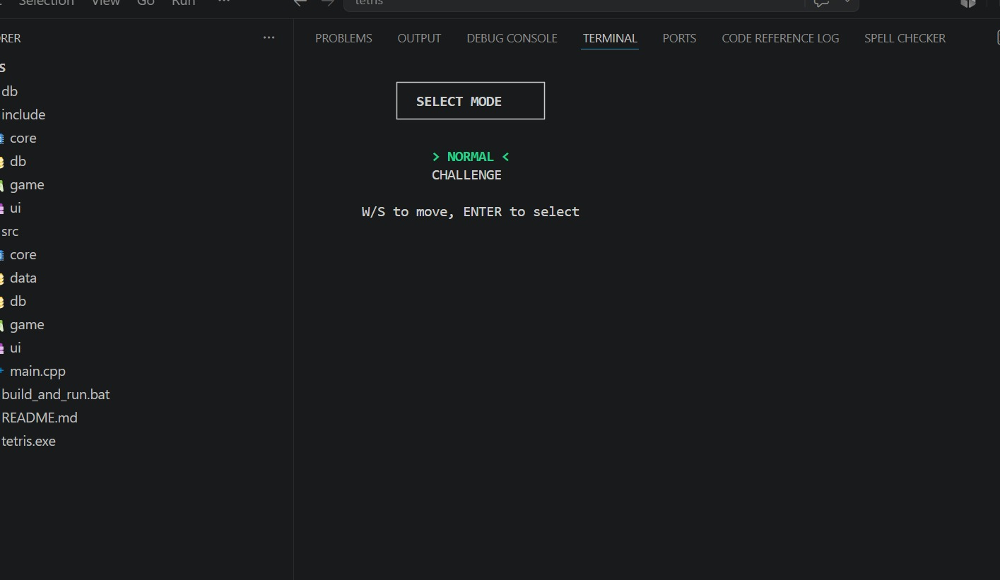
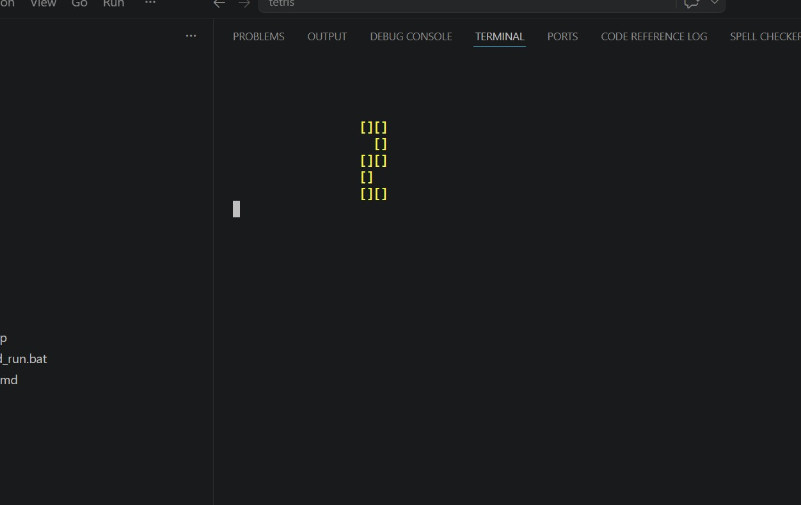

# Tetris Console Game

A polished Windows console implementation of Tetris written in C++.

## Introduction

This repository contains a terminal-based Tetris game designed for the Windows command line. It combines real-time gameplay, score persistence, and a responsive console UI while maintaining a clean, modular codebase.

## Highlights

- Fully playable Tetris game in the Windows console
- Normal and Challenge gameplay modes
- Persistent player records with leaderboard support
- UTF-8 encoding and ANSI escape handling for improved console output
- Modular architecture with clear, readable code
- Clean separation of game logic, UI, core data, and persistence

## Project Layout

- `src/` — implementation files
- `include/` — header files organized by subsystem
- `db/` — score storage data
- `images/` — image assets or visual resources
- `build_and_run.bat` — Windows build and execution script

Notable folders:

- `src/ui/` and `include/ui/` — console rendering, input handling, and utility functions
- `src/game/` and `include/game/` — game loop, rules, and state management
- `src/core/` and `include/core/` — board and piece definitions
- `src/db/` and `include/db/` — score loading, saving, and leaderboard management
- `src/data/` — piece definitions and shape metadata

## Visual Preview

The `images/` folder contains representative screenshots that demonstrate the game flow and user interface.

### Gameplay Board



Core gameplay board showing falling tetrominoes, line clearing, and score details.

### In-Game Menu



Menu overlay displayed during play, including pause controls and navigation.

### Mode Selection



Choice screen for selecting Normal or Challenge mode.

### Countdown Screen



Pre-game countdown display that appears before gameplay begins.

### Endgame Summary

.jpeg)

Final screen showing game over status, score, and leaderboard details.

You can use these images for documentation, review, or presentation alongside the executable experience.

## System Requirements

- Windows 7 or later (Windows 10/11 recommended)
- Internet connection (only for initial setup)
- Administrator privileges (for automatic setup)
- 100 MB free disk space

**Note:** The `setup.bat` script will automatically install all required dependencies including the GCC compiler (MinGW).

## Quick Start (Automated Setup)

### Option 1: Automatic Installation (Recommended)

1. Download or clone this repository
2. Right-click `setup.bat` and select **"Run as administrator"**
3. Follow the on-screen instructions
4. The script will automatically:
   - Download MinGW compiler (~50 MB)
   - Install all dependencies
   - Configure system PATH
   - Verify installation
   - Build and run the game

**That's it!** Everything is automated. No manual configuration needed.

### Option 2: Quick Build (If MinGW Already Installed)

From the project root, execute:

```bat
build_and_run.bat
```

The script compiles the source code into `tetris.exe` and launches the game automatically if compilation succeeds.

### Option 3: Manual Build

```bat
g++ src/main.cpp src/ui/tetris.cpp src/ui/colors.cpp src/ui/Menu.cpp src/data/piecedata.cpp src/core/Piece.cpp src/core/Board.cpp src/game/Game.cpp src/game/GameTime.cpp src/game/GameLogic.cpp src/game/GameInput.cpp src/game/GameDraw.cpp src/db/ScoreDB.cpp -I include/ui -I include/core -I include/game -I include/db -o tetris.exe
```

Then run:

```bat
tetris.exe
```

## Gameplay

1. Launch the game.
2. Enter a player name.
3. Select either Normal or Challenge mode.
4. Control falling tetrominoes and clear lines to earn points.
5. Track high scores and player statistics across sessions.

## Persistence

The game stores player statistics in `db/scores.json`. If the file is missing, it is generated automatically when the application saves scores.

## Notes

- Challenge mode is designed to be more intense, with a shorter time window and higher score goals.
- The project is structured to simplify future enhancements and testing.

## License

No license is included in this repository. Add a license file if you want to specify reuse terms.
